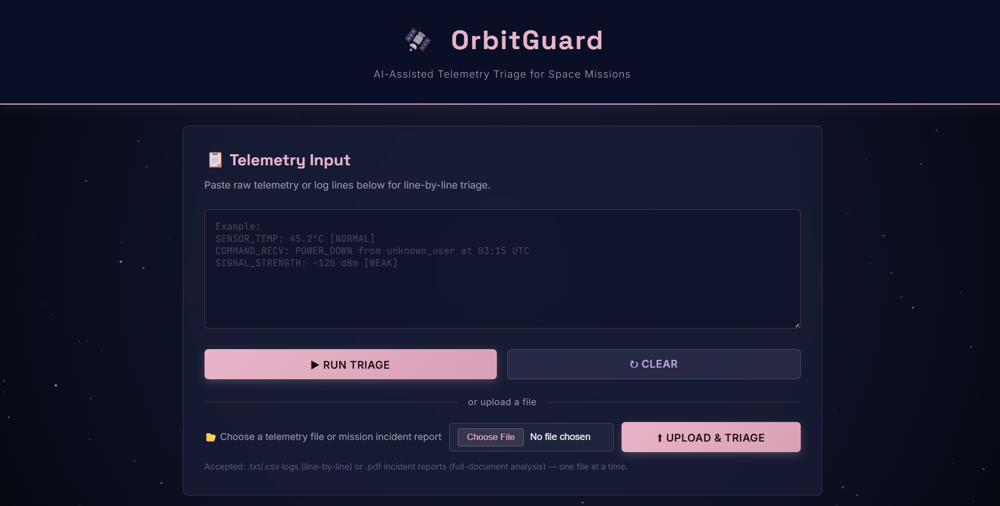
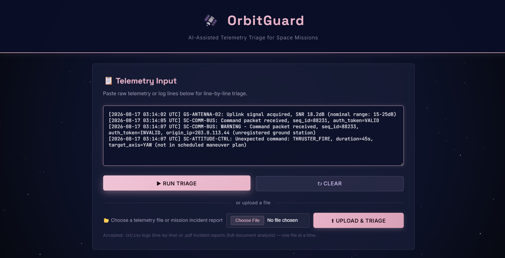
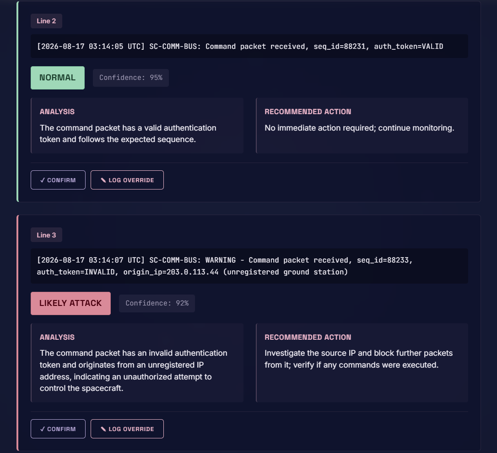
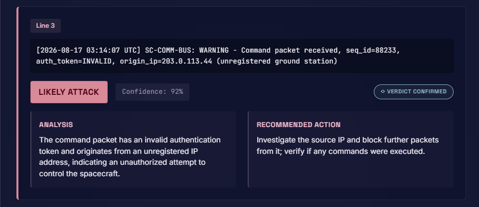
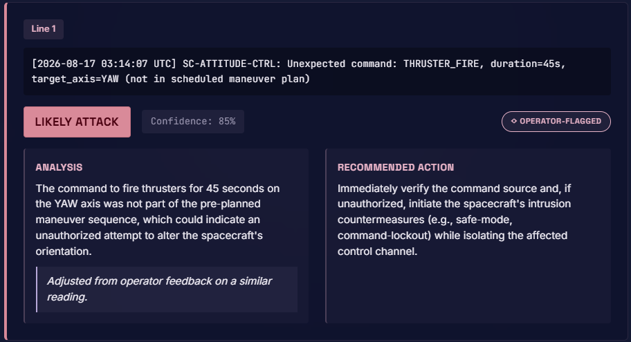
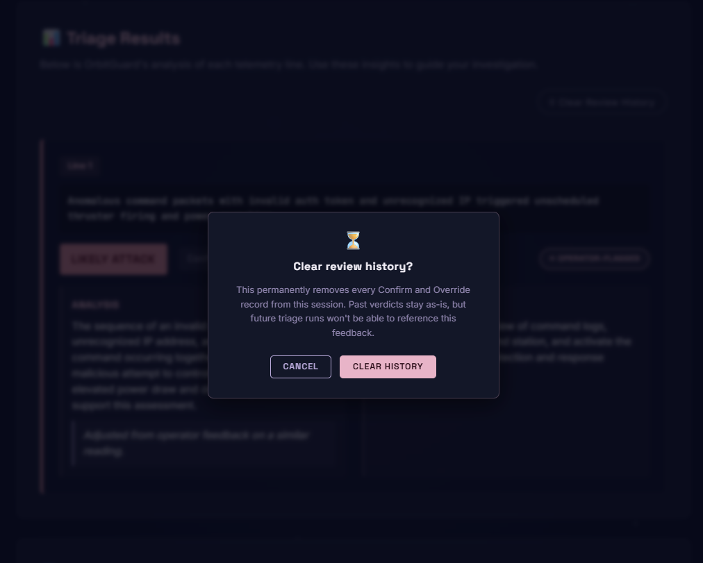
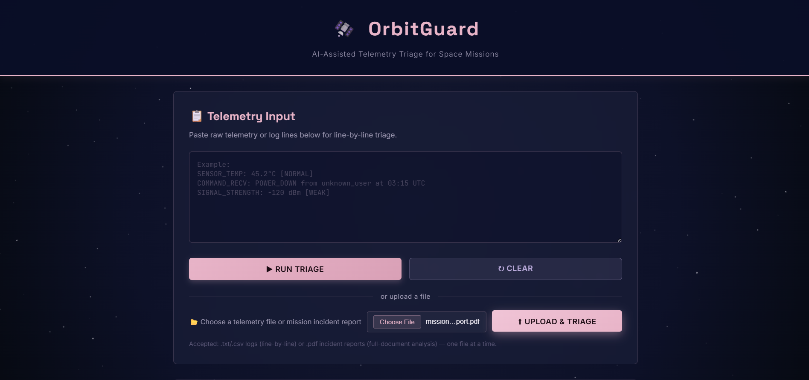
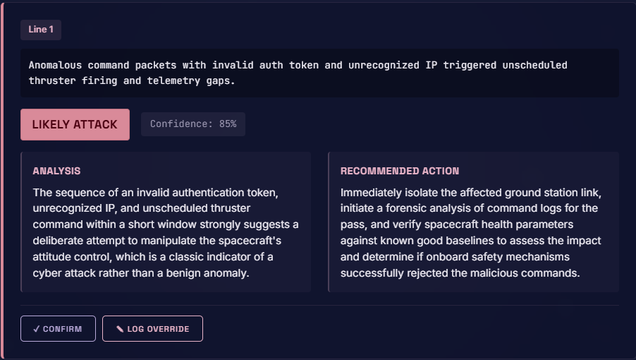

<div align="center">

# 🛰️ OrbitGuard
### AI-Assisted Telemetry Triage for Space Missions

*Built for the IBM AI Builders Challenge — Advance Space Exploration with AI*

<br/>


</div>
<br/>
<div align="center">



</div>
<br/>

---

## 📡 What Is OrbitGuard?

OrbitGuard is an AI-powered triage assistant that helps space-mission operators cut through the noise in spacecraft and ground-station telemetry logs — fast. Paste your telemetry, click **Run Triage**, and receive a plain-language breakdown of every line: what looks normal, what looks suspicious, and exactly what to do next.

---

## 🌌 The Problem

Modern space systems — satellites, ground stations, and mission-control networks — are increasingly targeted by sophisticated cyberattacks. The challenge for operators is that **the symptoms of a cyberattack often look identical to an ordinary malfunction**: an unexpected command, an anomalous signal, an off-schedule data packet.

When something goes wrong during a mission, operators may have only minutes to decide whether they're dealing with a hardware glitch or an active intrusion. Getting that call wrong can mean losing a spacecraft.

This is not hypothetical. In 2007 and 2008, hackers gained unauthorized access to two real NASA/USGS satellites — Landsat-7 and Terra AM-1 — through a ground station in Norway. A US congressional commission later confirmed that in one incident, the intruders "achieved all steps required to command the satellite" but did not issue commands. From the outside, that moment was indistinguishable from ordinary interference. OrbitGuard exists to close exactly that gap.

---

## 🛡️ The Solution

OrbitGuard acts as a **first-pass triage partner** for the human operator. It ingests raw telemetry lines (or full mission incident reports) and uses AI to classify each one, delivering:

| Output | Description |
|---|---|
| **Verdict** | `Normal` / `Suspicious` / `Likely Attack` with a confidence score |
| **Explanation** | A plain-language reason — no jargon, no black box |
| **Next Step** | A concrete recommended action for the operator |

OrbitGuard does not make autonomous decisions. It surfaces what matters, explains its reasoning, and keeps the human operator firmly in control.

---

## ✨ Key Features

- 🔍 **Line-by-line telemetry analysis** — every log entry gets its own verdict
- 🧠 **AI-generated explanations** — understand *why* something looks suspicious, not just *that* it does
- ⟡ **Operator feedback loop** — confirm a verdict or log an override with a note; OrbitGuard remembers it, and future similar readings are reasoned about in light of that feedback — without ever overriding the operator's authority to decide
- ✅ **Actionable next steps** — no ambiguity; each result tells the operator what to do
- 🎨 **Mission-control UI** — deep navy + dusty-rose/lavender aesthetic built for clarity under pressure
- ⚡ **Zero setup for operators** — paste logs, click a button, get results
- 📎 **Flexible ingestion** — paste text directly, or upload `.txt` / `.csv` telemetry logs and `.pdf` mission incident reports
- 🔒 **Secrets-safe** — API keys live in `.env`, never in the browser or repository

---

## 🤖 AI Approach & Architecture

OrbitGuard uses **IBM Granite** (via **IBM watsonx**) as its reasoning engine. Granite was chosen for its strong performance on structured analytical tasks and its alignment with IBM's enterprise-grade AI principles.

The analysis pipeline is intentionally straightforward:

```
[ Operator pastes telemetry logs or uploads a file ]
                     │
                     ▼
        [ Flask backend receives input ]
                     │
                     ▼
   [ IBM Granite (via watsonx) analyzes each line ]
   → Classifies: Normal / Suspicious / Likely Attack
   → Generates plain-language explanation
   → Suggests operator next step
                     │
                     ▼
   [ Results rendered as color-coded verdict cards ]
   🟢 Normal   🟡 Suspicious   🔴 Likely Attack
```

The prompt is structured to keep Granite grounded in the telemetry context — it is given the telemetry line, the mission context, and asked to reason step by step before delivering a verdict. This reduces hallucination and keeps explanations factual.

---

### 🔁 The Operator Feedback Loop

OrbitGuard treats the human operator as more than an end recipient of verdicts — their judgment actively shapes future analysis. Every verdict card carries two actions:

| Action | What Happens |
|---|---|
| **Confirm** | Locks in agreement with Granite's verdict — stamped ◇ Verdict Confirmed |
| **Log Override** | Operator adds a note explaining their own read of the situation — stamped ◇ Operator-Flagged |

This feedback is stored locally per operator session. When a new telemetry reading shares a sensor or parameter with a previously-reviewed one, OrbitGuard surfaces the operator's earlier note directly inside Granite's reasoning prompt — visibly marked on the resulting card with *"Adjusted from operator feedback on a similar reading."*

```
[ Operator confirms ◇ or overrides ⟡ a verdict, optionally with a note ]
                          │
                          ▼
         [ Feedback stored locally, keyed to the reading ]
                          │
                          ▼
   [ A similar reading appears in a future triage run ]
                          │
                          ▼
   [ Granite reasons with that operator context in view ]
   → Low-risk readings: verdict may relax, and Granite's own
     explanation references the operator's note directly
   → High-risk / critical readings: verdict holds firm —
     operator context informs the analysis, never softens
     a genuine threat assessment
```

Crucially, this is **feedback, not automation**. Granite doesn't remember on its own initiative, and it never lets a past override silently reclassify a genuinely dangerous reading. The operator's authority to confirm or override *again* is always live — every card, every time. This is "AI explains, human decides" made visible and persistent, not just a stated principle.

---

**IBM Docling** is integrated in the pipeline to handle uploaded files. `.txt` and `.csv` logs are parsed and triaged line-by-line, while `.pdf` mission incident reports are parsed as a single structured document — showcasing Docling's ability to extract and preserve tables and layout from real-world report formats — and triaged as one unified incident.

---

## 🧰 Tech Stack

| Layer | Technology |
|---|---|
| **Backend** | Python 3, Flask |
| **AI Model** | IBM Granite (via IBM watsonx) |
| **AI Platform** | IBM watsonx.ai |
| **Document Parsing** | IBM Docling |
| **Frontend** | HTML5, CSS3, Vanilla JavaScript |
| **Config** | python-dotenv |

---

## 🤝 How IBM Bob Was Used

IBM Bob was the **primary development tool** for this entire project. Bob was used to:

- **Plan the architecture** — breaking the project into stages and mapping out the Flask routes, frontend structure, and AI integration approach before a single line of code was written
- **Scaffold the codebase** — generating the initial `app.py`, `index.html`, `style.css`, and `script.js` files with full comments and structure
- **Integrate IBM Granite and Docling** — wiring up the watsonx API calls and file-parsing pipeline through iterative, plain-English prompting
- **Iterate on the UI** — refining the mission-control aesthetic, color scheme, and component layout through conversation
- **Write this README** — the full documentation was drafted collaboratively with Bob based on the actual project files

Bob acted as a knowledgeable co-developer throughout — not just an autocomplete tool, but a planning partner that understood the project goals and helped make deliberate technical decisions.

---

## 📸 Screenshots

<br/>

**Landing screen**

The mission-control interface at rest — a subtle twinkling starfield behind a clean telemetry input panel, ready for an operator to paste logs or upload a file.


<br/>

**Running a triage**

Sample telemetry pasted directly into the input box, ready to run.



<br/>

**Verdict range: Normal → Likely Attack**

A normal command packet (green, 95% confidence) sits right next to a compromised one flagged as Likely Attack (red, 92% confidence) — showing OrbitGuard's full verdict range in a single triage run, each with its own plain-language analysis and recommended action.



<br/>

**Operator confirms a verdict**

When Granite's read matches the operator's own judgment, one click locks it in — no re-typing, no second-guessing the obvious.



<br/>

**Operator override — the feedback loop in action**

An operator flags a Suspicious verdict (75% confidence) with a note linking it to a related anomaly elsewhere in the log. The next time OrbitGuard sees a similar reading, Granite factors that human judgment into its reasoning — upgrading the verdict to Likely Attack (85% confidence) and marking the card OPERATOR-FLAGGED, with a visible note that the read was adjusted from prior operator feedback.



<br/>

**Clearing review history**

A confirmation step before wiping stored operator feedback for the session — a deliberate reset, not an accidental one.



<br/>

**Mission incident report (PDF) upload**

A full `.pdf` mission incident report selected and ready for triage, showcasing file upload support alongside pasted-text input.



<br/>

**Mission incident report (PDF) verdict**

Docling parses the report as a single structured document, and OrbitGuard delivers one unified verdict for the entire incident.



<br/>

---

## 🚀 Setup & How to Run

### 1. Clone the repository

```bash
git clone https://github.com/Afzaam/orbitguard.git
cd orbitguard
```

### 2. Create a virtual environment and install dependencies

```bash
python -m venv venv
venv\Scripts\activate        # Windows
# source venv/bin/activate   # macOS / Linux

pip install -r requirements.txt
```

### 3. Configure environment variables

```bash
copy .env.example .env       # Windows
# cp .env.example .env       # macOS / Linux
```

Open `.env` and fill in your IBM watsonx credentials:

```env
WATSONX_API_KEY=your-api-key-here
WATSONX_PROJECT_ID=your-project-id-here
WATSONX_URL=https://api.us-south.ml.cloud.ibm.com
```

### 4. Run the app

```bash
python app.py
```

### 5. Open in your browser

Navigate to **http://127.0.0.1:5000**, paste some telemetry, and click **Run Triage**.

**Sample telemetry to try:**
```
SENSOR_TEMP: 45.2°C [NORMAL]
COMMAND_RECV: POWER_DOWN from unknown_user at 03:15 UTC
SIGNAL_STRENGTH: -120 dBm [WEAK]
```

---

## 🔭 Future Work

- **Real satellite data integration** — connect OrbitGuard to live telemetry streams from publicly available satellite feeds (e.g., NORAD, NASA Open Data)
- **Live ground-station feeds** — real-time WebSocket ingestion from ground-station software, enabling continuous background triage rather than manual paste-and-run
- **Mission profile context** — allow operators to specify the spacecraft type, mission phase, and known anomaly baselines so the AI can reason with mission-specific knowledge
- **Audit trail** — persistent logging of every triage session so operators can review decisions and retrain the model on confirmed incidents
- **Multi-language support** — internationalization for international mission-control teams
- **Operator authentication & role-based access control** — secure login for mission-control teams, with permission tiers distinguishing who can run triage versus who can review and act on results, for multi-user deployments

---

## 📁 Project Structure

```
orbitguard/
├── app.py                 # Flask backend — routes and watsonx integration
├── requirements.txt       # Python dependencies
├── .env.example            # Environment variable template
├── .gitignore              # Keeps secrets out of version control
├── README.md                # This file
├── docs/
│   └── screenshots/          # README screenshots
├── templates/
│   └── index.html            # Main UI
└── static/
    ├── style.css              # Mission-control styling (navy + dusty-rose/lavender)
    └── script.js               # Frontend logic (form, AJAX, result cards)
```

---

<div align="center">

*OrbitGuard — Built with ❤️ and IBM Bob | IBM AI Builders Challenge 2026*

</div>
